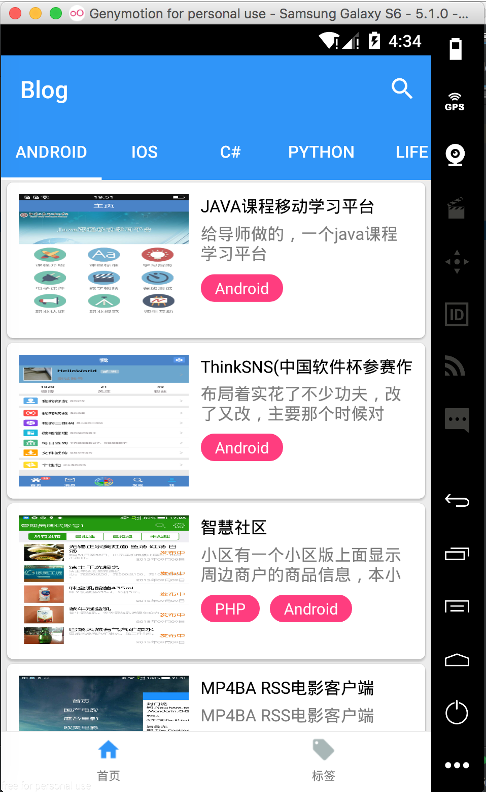
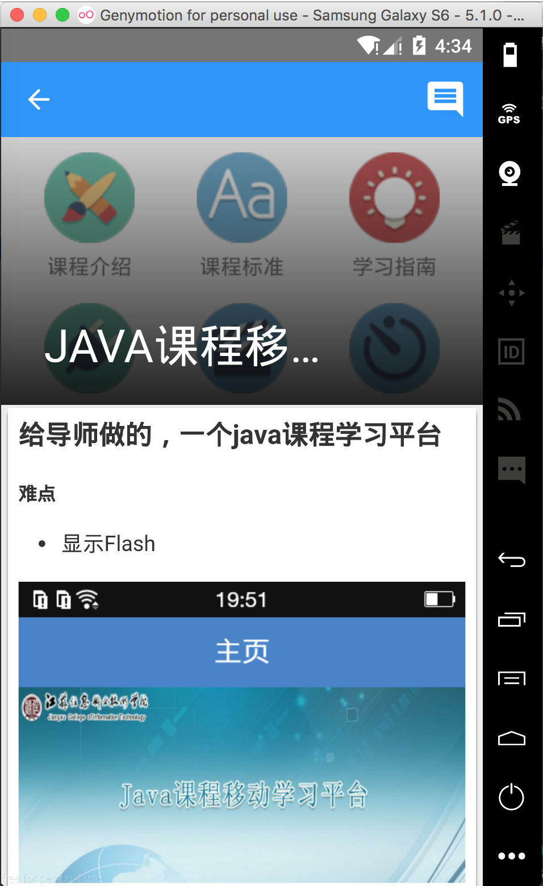
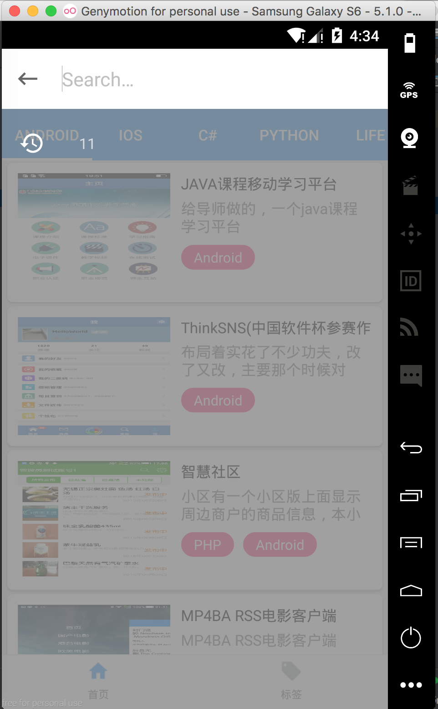

#开发背景
写了网页版的[博客](http://www.csi0n.com)怎么能没有客户端？！

#说明
- 使用的是MVP模式开发
- 使用了Rxjava响应式开发,butterknife注解,picasso加载图片,eventbus传递事件,retrofit2+OKHttp网络数据交互
- 同样基于Material Design设计风格

#图片

###其他链接:
- [前/后端/Api](https://github.com/csi0n/Ace-Admin-Blog)
- [Android版本](https://github.com/csi0n/Ace-Admin-Blog-Android)
- [IOS版本](https://github.com/csi0n/Ace-Admin-Blog-IOS)
- 后续还会有别的版本RN,Swift,kotlin....敬请期待.

enjoy it :)

